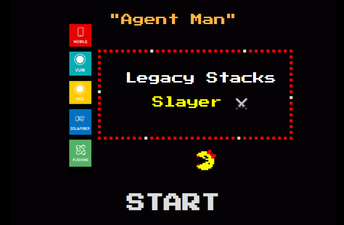

  
  
  # 🎮 Agent Desktop Quest
  
  **A modern JavaScript remake of the classic Ms. Pac-Man game**
  
  *Featuring updated graphics for the legacy stacks unifier experience*
  
  [](https://lighthearted-strudel-5cff36.netlify.app/)
  [](https://www.youtube.com/shorts/UqbHdHTxZEY)

## 🏆 Credits

* Original game algorithm is based on [The Pac-Man Dossier](https://pacman.holenet.info/)
* Enhanced with custom SVG graphics for the Agent Desktop Quest experience
* **Contributors**: Seifeldin Hesham, Shamseldeen Elgazzar 

## 🚀 Development

### Installation
```bash
npm install
```

### Available Scripts

| Command | Description |
|---------|-------------|
| `npm start` | 🏃 Run local dev server at `localhost:8080` |
| `npm test` | 🧪 Run tests |
| `npm run build` | 📦 Build production bundle |
| `npm run clean` | 🧹 Clean dist folder |

## 📄 License

Source code is under [MIT Licence](http://opensource.org/licenses/mit-license.php).
